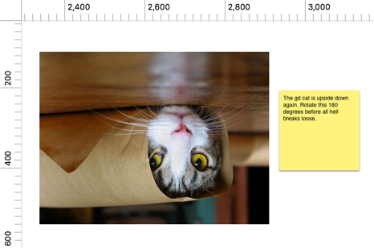

#### NEW IN VERSION 2.0 - The world's most advanced note taking plugin for Sketch just got advanceder
- Notes in FUN colors
- Set the resolution you are designing in and get appropriately sized notes
- Quickly hide all notes from the plugin menu

#### WHY IN THE HECK SHOULD I USE THIS?
Notes is useful for quickly writing down feedback about your designs, to-do list items, and/or your social security number (since who can be bothered to remember a string of numbers these days?).

#### INSTALLATION

1. Click that download button in the top right and get the zip file
2. Unpack the zip file
3. Double-click Notes.sketchplugin
4. Wow

#### USAGE (AKA CMD + L)
Press CMD + L to insert a new note.

#### FUTURE CONSIDERATIONS
- [x] Auto-hide all Notes on a page
- [x] Dynamic sizing based on view size
- [x] FUN colors
- Email me jason.cashdollar@gmail.com if you have any other ideas.

##### Thanks to [Zack Schiller](https://twitter.com/zacharyschiller) for helping me make sense of the poorly documented world of sketch plugins.

