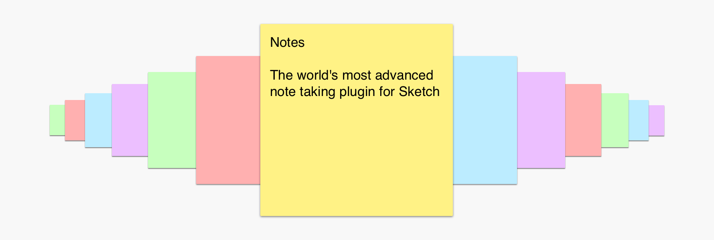

# Notes
The world's most advanced note taking plugin for Sketch.

#### WHY IN THE HECK SHOULD I USE THIS?
Notes is useful for quickly writing down feedback about your designs, to-do list items, and/or your social security number (since who can be bothered to remember a string of numbers these days?).

#### INSTALLATION

1. Click that download button in the top right and get the zip file
2. Unpack the zip file
3. Double-click Notes.sketchplugin
4. Wow

#### USAGE (AKA CMD + Y)
Press CMD + Y to insert a new note.

#### Thanks to Zack Schiller for helping me make sense of the poorly documented world of sketch plugins.
